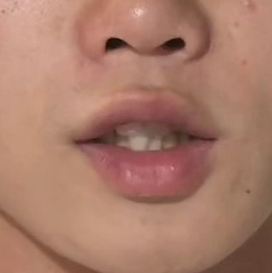
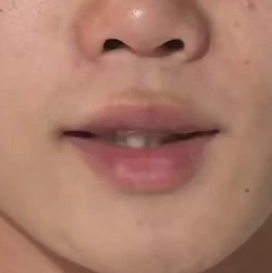

# Chinese words classification using LipNet

----

The project is the source code used in the data contest [1]. In this project, I tried to classify the video clips into several words categories. There is always one person speaking a certain Chinese word in the video clips and the video clips only mainly contain the mouth part. The selected frames of the samples are shown as Fig 1.

<table boarder='2px'>
    <tr>
        <td>
            
        </td>
        <td>
            
        </td>
    </tr>
</table>

<div align='center'>
    <b>
        Fig 1. The selected frames of the samples.
    </b>
</div>

There are 313 words categories in the whole training set and test set and the categories between training and test set are totally overlapped. The words categories like:  `生活`, `一年一度`, `众所周知`. The length of the words vary from 2 to 4 characters. The length of the video clips vary from 2 to 24 frames.

I treated this problem as the classification problem and import  Connectionist Temporal Classification (CTC) loss, word length regression loss and words categories prediction loss to model this problem. 

The network framework is shown as Fig 2. Note that the video clips have been pre-processed  and only the mouth 

![framework][framework]

<div align='center'>
    <b>
        Fig 2. The network framework.
    </b>
</div>


----

# Development environment

This project has been totally tested on the platform `Ubuntu 16.04` with `CUDA 10.2` using `python 3.6`.

To make sure you can run the code, you basically need the following packages in `conda` envs:

1. `pytorch >= 1.0.0`
2. `torchvision >= 0.2.0`
3. `imgaug` ( optional for data augmentation)
4. `yaml`
5. `pandas`
6. `argparse` 
7. `jupyter notebook` (optional for running the jupyter notebook pre-processing files)

`conda` is recommended to use as the basic environment manager here, however, maybe `imgaug` need to use `pip` to install.

-----

# How to run

To roughly evaluate this project, just following 

```shell
source activate your_envs  # activate your conda environment
cd $(ProjecPath)/run_scripts/
sh run_lipnet_exp.sh
```

To change the experiments setting or the networks hyper-parameters, you can easily modify the `.yaml` config files in the folder `$(ProjectPath)/config/hypers/lipnet_ctc.yaml`

you can specify the `phase` to `train` or `test` to train your model or test your model. Specifying the `weights` to load the trained models' weights.


-----

# More about dataset

Since the dataset is provided by the sponsor of the contest, I don't have the authorization to distribute it so I decide to leave the folder `$(ProjecPath)/dataset/` empty. If you want to evaluate this project, noting that you must put your own dataset to the folder `$(ProjecPath)/dataset` . In my case, the `dataset` folder structure looks like:

```shell
dataset/
├── center_mouth_rgb # has been extracted the mouth ROI area
│   ├── test # test set
│   └── train # whole training set, there is not any eval division
└── ctc_labels
    ├── char_codebook.npy  # the chars to index hash dictionary
    ├── ctc_char_classes.npy # 431 class of the chars
    ├── dictionary.txt # the dictionary of the whole words
    ├── index_files # train, test, eval and whole_train files' index
    └── word_codebook.npy # the words to index hash dictionary
```

In the dataloader, I only pre-load the index file in the `__init__` method and fetch the certain samples in the `__getitem__` method. To make everything in order, I save the index files as `.npy` files.

**Update 2019.11.17**:

Though I still don't have the authorization to distribute the whole dataset, for the purpose of making this project more practiced, I release 10 samples in `train/` and `test/` folders respectively as examples and release the whole label and codebook files in the `ctc_labels/` files.


-----


# How to extract the mouth ROI area

To extract the mouth ROI area, I exploited the `face_alignment` package [3]. It's a wonderful 2D&3D face alignment library even your target faces are not completed (e.g. only the mouth nearby area available). After you install the `face_alignment` package, to find more,  you can refer the jupyter notebook code in the `$(ProjectPath)/notebook/sep2-分割嘴唇区域——中心对齐法 on test set.ipynb` or  `$(ProjectPath)/notebook/face alignment.ipynb` and customize your own extraction program.

![2d3d][2d3d]

----

# The description of the project's folders

The project contains several folders, the structure looks like:

```shell
LipNet_ChineseWordsClassification/
├── codes # network, utils and dataloader codes
├── configs 
├── dataset # dataset and label
├── experiments # the main train and test eval processing
├── imgs 
├── LICENSE 
├── notebook # jupyter notebook for data pre-processing and visualization and data understanding
├── ReadMe.md 
├── run_scripts # running script to make thing simple
├── trained_models # trained model weights, saving the pre-trained models which are for the whole_train
├── results # the csv prediction results
└── workdir # saving the weights and log files


```


-----

# The ensemble strategy script

you can boost the performance by ensembling multiple difference models to make a more robust decision. It calls ensemble learning. Here I exploit simplest voting strategy, to find more detail, referring the script in `$(ProjectPath)/notebook/predict_ensemble.ipynb`. This script takes the voting of the separated csv prediction in the folder `$(ProjectPath)/results/`.

------

# Training details

To find more setting about the training including the optimizer, learning rate etc , You can find them clearly in the config file `$(ProjectPath)/config/hypers/liper_ctc.yaml`. The whole file is self explained.

---

# Reference

[1]. https://www.dcjingsai.com/common/cmpt/2019%E5%B9%B4%E2%80%9C%E5%88%9B%E9%9D%92%E6%98%A5%C2%B7%E4%BA%A4%E5%AD%90%E6%9D%AF%E2%80%9D%E6%96%B0%E7%BD%91%E9%93%B6%E8%A1%8C%E9%AB%98%E6%A0%A1%E9%87%91%E8%9E%8D%E7%A7%91%E6%8A%80%E6%8C%91%E6%88%98%E8%B5%9B-AI%E7%AE%97%E6%B3%95%E8%B5%9B%E9%81%93_%E7%AB%9E%E8%B5%9B%E4%BF%A1%E6%81%AF.html

[2].  Assael Y M , Shillingford B , Whiteson S , et al. LipNet: End-to-End Sentence-level Lipreading[J]. 2016. 

[3].  https://github.com/1adrianb/face-alignment 


[framework]: ./imgs/framework.png
[2d3d]: ./imgs/2d3d.png

